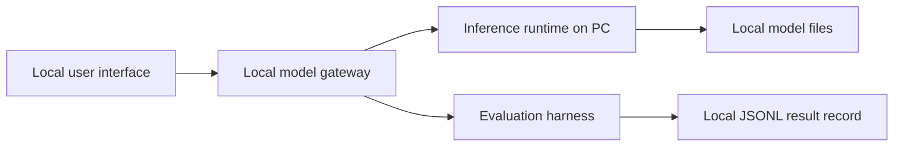

# Somalia AI Local Lab

An open reference architecture for running and measuring AI on everyday PCs, with Somali and English as concrete language examples.

**Project status: early blueprint.** The repository contains architecture notes and a small benchmark harness for an OpenAI-compatible local inference endpoint. No model or hardware has been benchmarked yet, so this project makes no speed or quality claims.

## Why this project

Local inference can make AI more available when cloud connectivity, cost, or data location matters. The useful question is not simply “Which model is fastest?” It is: which model, runtime, and settings fit a particular PC and task, and what quality, latency, memory, and energy trade-offs come with that choice?

The initial scope is intentionally small:

- a clear, replaceable local-first architecture;
- a standard-library Python measurement script for a local OpenAI-compatible chat endpoint;
- result records that capture model and machine context without saving prompt text or model output;
- Somali and English examples, with language quality treated as something to evaluate with fluent reviewers rather than assume.

## Architecture



See [`docs/architecture.md`](docs/architecture.md) for component boundaries and [`docs/evaluation.md`](docs/evaluation.md) for the measurement plan.

## Try the measurement harness

Start a local inference server that exposes an OpenAI-compatible `/v1/chat/completions` endpoint, then run:

```bash
python tools/bench_local.py --base-url http://127.0.0.1:8080/v1 --model local-model
```

The starter prompt is a harmless English smoke prompt. Provide your own prompt with `--prompt-text` and label it with `--language` and `--prompt-id`. The script only permits loopback addresses by default, sends one non-streaming request, and records metadata and latency to a JSONL file; it does not save the prompt or generated answer. Add `--allow-remote` only when you intentionally want to send the prompt to a non-local server.

```bash
python tools/bench_local.py \
  --base-url http://127.0.0.1:8080/v1 \
  --model my-local-model \
  --language so \
  --prompt-id somali-summary-01 \
  --prompt-text "Ku soo koob fikraddan hal jumlad:"
```

The returned token rate is calculated only when the server reports completion-token usage. A single run is not a benchmark; repeat runs and document warm-up, settings, and variance before comparing systems.

## What to contribute

Good first contributions include:

- setup notes for a specific operating system or inference runtime;
- hardware profiles with exact specifications and reproducible run records;
- carefully sourced, licensed Somali or English evaluation prompts;
- tests and adapters for other local OpenAI-compatible servers;
- fluent review of language examples and evaluation criteria.

Please read [`CONTRIBUTING.md`](CONTRIBUTING.md) before opening a pull request. Never include private prompts, credentials, copyrighted evaluation material without permission, or unverified benchmark claims.

## Project contributors

- **Thomas** — [thomas@austenaa.no](mailto:thomas@austenaa.no) · [thomasaustenaa@gmail.com](mailto:thomasaustenaa@gmail.com)
- **Arne** — [arne@austenaa.no](mailto:arne@austenaa.no) · [austenaa92@gmail.com](mailto:austenaa92@gmail.com)

## Project site

[Somalia AI Local Lab](https://somalia-ai-local-lab.tussienorway.chatgpt.site) · independent project; not affiliated with or endorsed by OpenAI, Google, or model providers.

## License

MIT; see [`LICENSE`](LICENSE).
