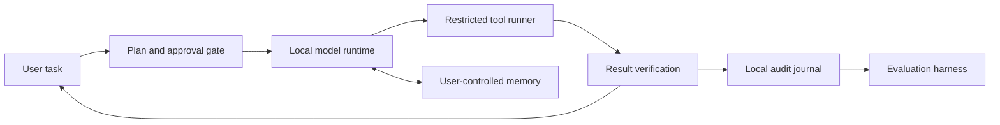

# Norwegian AI Local Lab

An open project exploring a practical personal AI assistant for home PCs: local inference, user-controlled memory, bounded tools, and reproducible evaluation. Language examples will include Norwegian, English, and Somali, with quality reviewed by fluent speakers rather than assumed.

**Project status: early prototype.** The repository contains a reference architecture, a one-request local benchmark harness, and a first bounded workspace assistant. The assistant can list and read text files in one selected directory and propose a file replacement, but an operator must review its diff and type `APPLY` before the change is written. It has no shell or background execution. The first Windows development machine and its installed runtimes are now inventoried, but persistent project memory is not implemented and no model-run or benchmark results have been recorded yet.

## Why this project

Local inference can make an assistant more available when cloud connectivity, cost, or data location matters. The useful question is not simply “Which model is fastest?” It is: can a particular PC run a useful assistant with dependable memory and carefully bounded tools, and what quality, latency, memory, and energy trade-offs come with that choice?

The initial scope is deliberately testable:

- a clear, replaceable local-first assistant architecture with explicit permission gates;
- a standard-library Python measurement script for a local OpenAI-compatible chat endpoint;
- result records that capture model and machine context without saving prompt text or model output;
- Norwegian, English, and Somali examples, with language quality treated as something to evaluate with fluent reviewers rather than assume;
- a staged plan for adding inspectable memory and a restricted tool runner.

The project is not a company case study and does not claim customers, institutional backing, security certifications, or measured results. Any access request will describe the project and its contributors accurately.

## Architecture

The diagram below is the **proposed design**, not a description of a completed assistant.



See [`docs/architecture.md`](docs/architecture.md) for the proposed assistant design, [`docs/evaluation.md`](docs/evaluation.md) for the measurement plan, and [`docs/roadmap.md`](docs/roadmap.md) for implementation stages.

The first reproducible environment snapshot is in [`docs/runtime-profile-thomas-pc.md`](docs/runtime-profile-thomas-pc.md). It records the verified Windows, CPU, RAM, GPU, Ollama, and Hermes setup while keeping credentials and personal configuration out of the repository.

## Try the bounded assistant

Start an OpenAI-compatible local model server, create a disposable workspace, and run:

```bash
python tools/local_workspace_assistant.py \
  --workspace ./scratch-demo \
  --model your-local-model \
  "Read the project note and propose a clearer title."
```

The prototype limits file access to the selected workspace, has no shell tool, and requires interactive approval before a write. Read the full behavior and current limitations in [`docs/local-assistant.md`](docs/local-assistant.md) before using it with real files.

## Proposed pilot

The pilot brief stages the work: verify the machines, reproduce one local model setup, build an approval-gated workspace task, and then evaluate it with a small, licensed or self-authored task set. It defines what would count as evidence and what remains only a proposal. See [`docs/pilot-brief.md`](docs/pilot-brief.md).

If requesting provider access, use the factual template in [`docs/access-request.md`](docs/access-request.md). A project or public repository does not by itself qualify its maintainers for a free subscription, and the request must not imply otherwise.

## Try the measurement harness

Start a local inference server that exposes an OpenAI-compatible `/v1/chat/completions` endpoint, then run:

```bash
python tools/bench_local.py --base-url http://127.0.0.1:8080/v1 --model local-model
```

The starter prompt is a harmless English smoke prompt. Provide your own prompt with `--prompt-text` and label it with `--language` and `--prompt-id`. The script permits loopback addresses by default, blocks redirects to non-loopback hosts unless `--allow-remote` is set, sends one non-streaming request, and records metadata and latency to a JSONL file; it does not save the prompt or generated answer. Add `--allow-remote` only when you intentionally want to send the prompt to a non-local server.

```bash
python tools/bench_local.py \
  --base-url http://127.0.0.1:8080/v1 \
  --model my-local-model \
  --language so \
  --prompt-id somali-summary-01 \
  --prompt-text "Ku soo koob fikraddan hal jumlad:"
```

The returned token rate is calculated only when the server reports completion-token usage. A single run is not a benchmark; repeat runs and document warm-up, settings, and variance before comparing systems.

## What to contribute

Good first contributions include:

- setup notes for a specific operating system or inference runtime;
- hardware profiles with exact specifications and reproducible run records;
- carefully sourced, licensed Norwegian, Somali, or English evaluation prompts;
- tests and adapters for other local OpenAI-compatible servers;
- fluent review of language examples and evaluation criteria.

Please read [`CONTRIBUTING.md`](CONTRIBUTING.md) before opening a pull request. Never include private prompts, credentials, copyrighted evaluation material without permission, or unverified benchmark claims.

## Project contributors

- **Thomas** — [thomas@austenaa.no](mailto:thomas@austenaa.no) · [thomasaustenaa@gmail.com](mailto:thomasaustenaa@gmail.com)
- **Arne** — [arne@austenaa.no](mailto:arne@austenaa.no) · [austenaa92@gmail.com](mailto:austenaa92@gmail.com)

## Project site

Norwegian AI Local Lab is an independent project; it is not affiliated with or endorsed by OpenAI, Google, or model providers. ChatGPT subscriptions and API access are separate products: this local endpoint harness does not use a ChatGPT subscription as an API credential.

## License

MIT; see [`LICENSE`](LICENSE).
