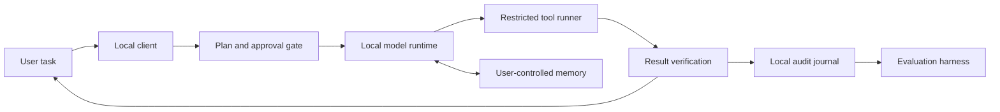

# Local assistant reference architecture

## Purpose

Explore how a personal AI assistant can run on a home PC, keep useful continuity between sessions, and use a small set of tools without giving a model unchecked control of the computer. The project is an early design and evaluation effort. It is not an AGI claim or a finished autonomous assistant.

## Current implementation

The repository contains a starter measurement script and a bounded command-line assistant. The assistant can list and read UTF-8 text files inside one explicitly selected workspace, propose a complete file replacement, show a diff, require interactive approval, apply the write atomically, and verify the result. It has no shell tool, external communication tool, background scheduler, or persistent project memory. No hardware or model results have been published.

## Proposed data path

The model proposes plans and tool calls. A separate policy layer checks each call against the task, allowed workspace, and approval requirements. The tool runner returns observations; the model can then revise its plan. The loop stops when the requested result is verified, a limit is reached, or the user needs to decide what happens next.

## Memory model

Start with simple, inspectable storage rather than a background vector database:

| Layer | Initial representation | Rule |
| --- | --- | --- |
| Working context | Current task and recent observations | Keep only what is needed for the active task |
| Episodic journal | Local append-only JSONL or SQLite events | Record actions and outcomes; omit prompt and response text by default |
| Semantic memory | User-reviewed Markdown facts | Save only useful, durable facts with a source and review date |
| Procedures | Versioned, human-reviewed scripts | Load as proposals; do not let the model silently rewrite trusted procedures |

Memory must be inspectable, editable, exportable, and removable by its owner. A future retrieval index is optional and must be rebuildable from the source files.

## Tool permissions and recovery

- Start in read-only mode and restrict file access to a named project workspace.
- Show a proposed plan before making changes. Require approval for writes outside the workspace, package installation, system settings, credentials, or external communication.
- Never execute arbitrary shell text from a model response. Use named tools with validated arguments and explicit scope.
- Do not grant root access or mount the user's whole home directory into a sandbox.
- Do not capture screenshots or inspect unrelated files in the background.
- Keep a journal of proposed actions, approvals, tool results, and verification outcomes, with secrets and private content redacted.
- Use Git only in the project workspace for reviewable file history. Do not describe that as a system snapshot or promise automatic rollback of operating-system changes.
- Resume long-running projects from a visible, user-controlled backlog. A heartbeat may remind or prepare a proposal; it must not execute queued tasks unattended.

## Model and service boundaries

The reference path is local inference through a documented local runtime. A hosted model can be evaluated separately through its supported API or product interface and with its own data and billing terms. Consumer subscriptions are not API credentials, and this project does not claim that a subscription quota can be routed through a local proxy.

## Evaluation targets

The first agent prototype should demonstrate three bounded tasks in a disposable workspace:

1. Find and summarize a file while citing the file path and relevant passage.
2. Propose a small file edit, wait for approval, apply it, and verify the resulting diff.
3. Resume a multi-step task from an explicit backlog without repeating completed steps or running unapproved actions.

Record successful, failed, and interrupted runs. Evaluate task completion, unsupported claims, permission handling, recovery, latency, and memory use separately. Hardware-specific results must include the actual machine, model, runtime, settings, and prompt-set version.

## Not in scope for the first prototype

Unattended execution, self-modifying trusted code, unrestricted access to the operating system, persistent screenshots, autonomous purchasing or account changes, and claims of general intelligence are explicitly out of scope.
